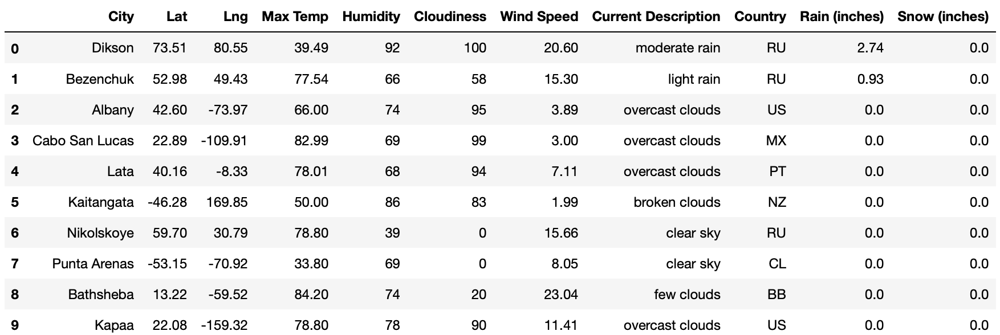
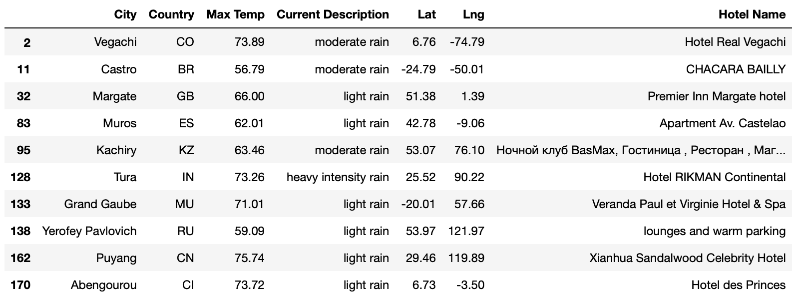
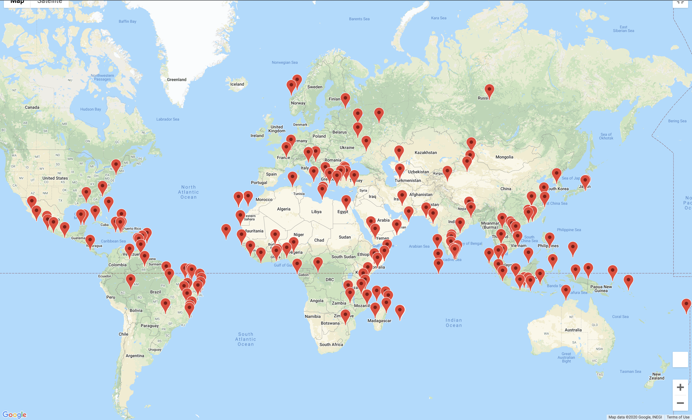
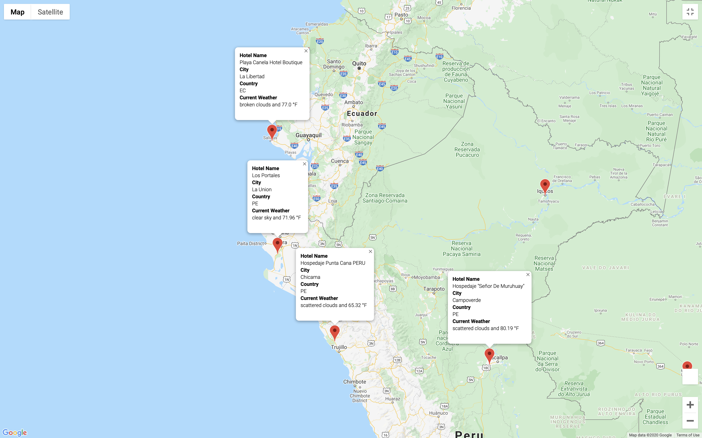
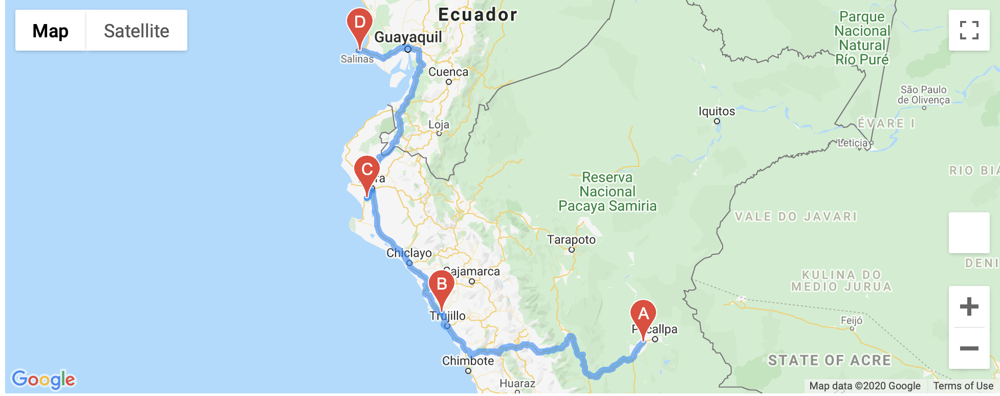
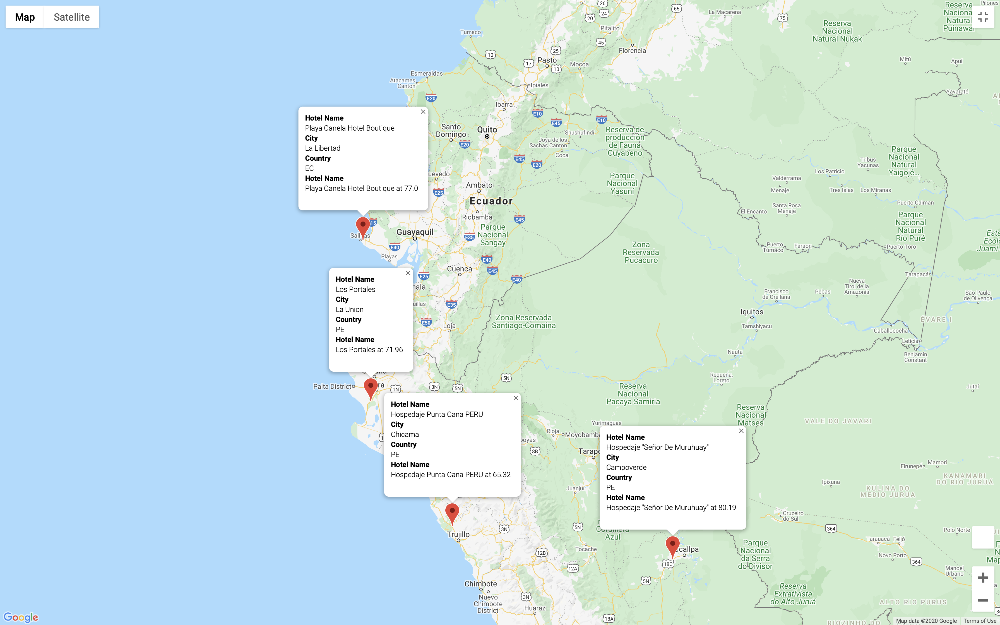

# World_Weather_Analysis

###project

Please not that all the output data that is in the jupyter notebook is continiously different when run from the images that are displayed below. This is due to the random coordinates generated, and the user inputs.

This program does the following:
- create 1,500 random coordinates. 
- We then use citpy to find the nearest city to these co-ordinates. 
- We then use the Open Weather API to get weather data points. 

- We then have the user select a max and min temp, whether they want rain, or snow. 
- We then take all these answers and filter them according to the inputs. 
- We then use a google API to find the first hotel in the filtered city list. This data is then scrubbed to get rid of entries that do not have a hotel within the radius that we specified. This dataframe is then saved into a CSV file. 

- We then create a google map with markers that contain the following: hotel name, city, country, and the current weather.

- We then ask the user to input 4 cities that are close to each other on the map. This then creates driving directions between the four cities. The route is based on the order that the cities are typed in.

- We then have a marker map that only displays the cities that were input by the user.

Possible improvements:
- When the user has to input temperatures and whether it is raining or snowing, I can add a response when the inputs are correct. If not addressed, then the code will choke.
- When we ask the user for 4 cities, we should have the inputs reference the dataframe to make sure that this city is in the list. If there is a typo, then we get an IndexError lower down. I don't think using try/except is good as now it will only display 3 cities, its better to fix the problem than skip it.
- I would also find out how far the cities are away from each other, if they are too far apart then I would have the user select another city.
